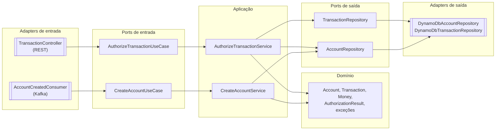
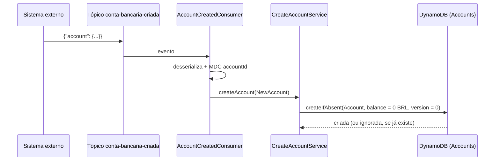
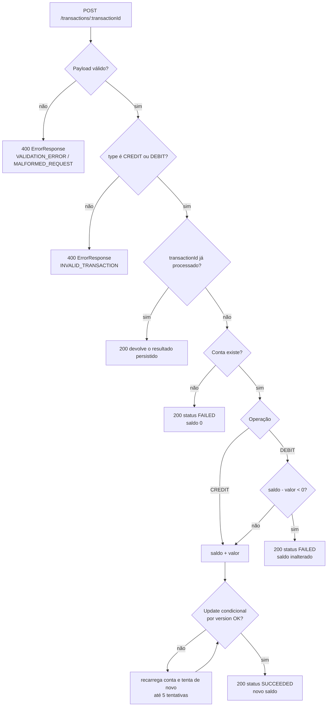
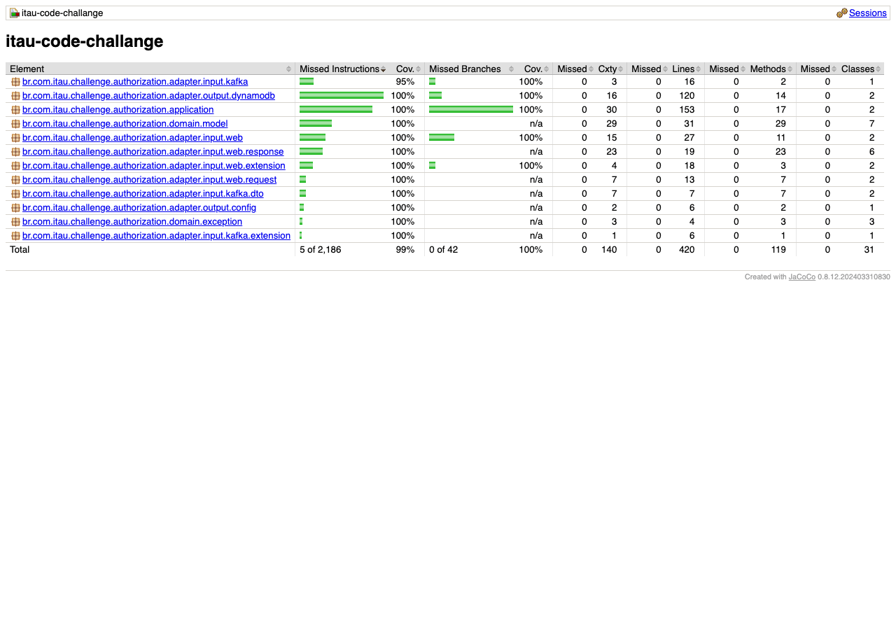
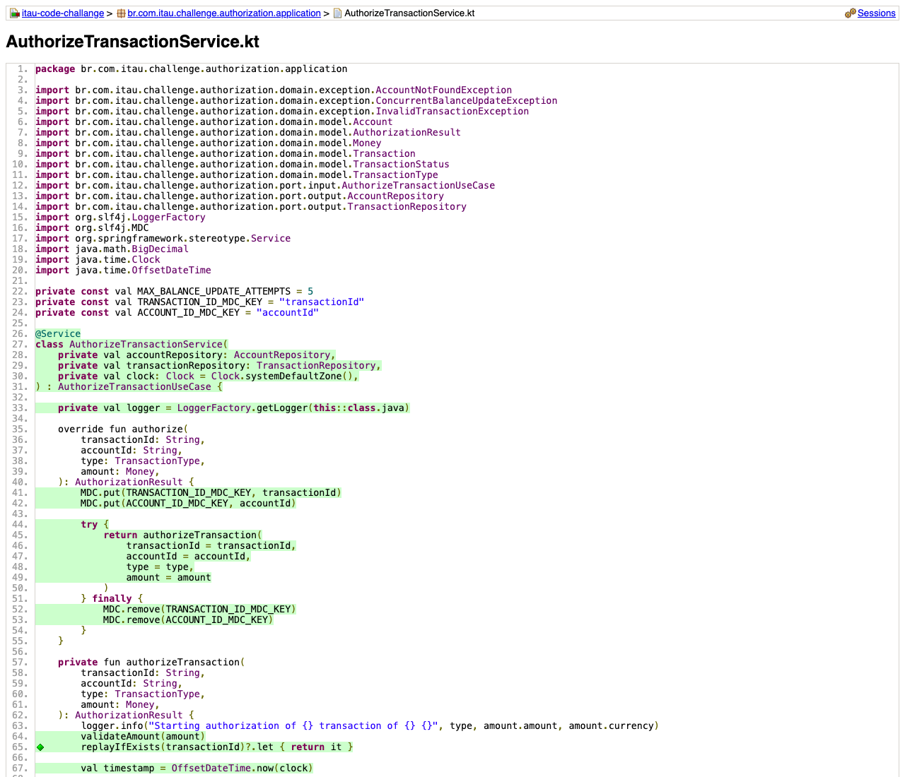

# Autorização de Transações — Desafio Técnico Itaú

[](../../actions/workflows/build.yml)
[](../../actions/workflows/test.yml)
[](../../actions/workflows/docker.yml)
[](../../actions/workflows/codeql.yml)

API de autorização de transações financeiras (crédito e débito) escrita em Kotlin com Spring Boot,
seguindo arquitetura hexagonal. A aplicação tem duas entradas:

1. **Inicialização de contas (Kafka)** — consome o tópico `conta-bancaria-criada` e persiste a conta
   no DynamoDB com **saldo inicial ZERO**, de forma idempotente.
2. **Autorização (REST)** — expõe `POST /transactions/{transactionId}`, aplica as regras de crédito e
   débito (débito que resultaria em saldo negativo é **recusado** e o saldo não se altera) e devolve o
   resultado da autorização junto com o saldo atualizado.

## Sumário

- [Objetivo do desafio](#objetivo-do-desafio)
- [Stack](#stack)
- [Arquitetura](#arquitetura)
- [Estrutura de pastas](#estrutura-de-pastas)
- [Fluxos](#fluxos)
- [Contrato da API](#contrato-da-api)
- [Documentação interativa (Swagger)](#documentação-interativa-swagger)
- [Mensageria Kafka](#mensageria-kafka)
- [Modelagem no DynamoDB](#modelagem-no-dynamodb)
- [Concorrência e resiliência](#concorrência-e-resiliência)
- [Observabilidade e logs](#observabilidade-e-logs)
- [Variáveis de ambiente](#variáveis-de-ambiente)
- [Como rodar](#como-rodar)
- [Comandos do Makefile](#comandos-do-makefile)
- [Testes](#testes)
- [Decisões deliberadas e extensões à especificação](#decisões-deliberadas-e-extensões-à-especificação)
- [O que faria com mais tempo](#o-que-faria-com-mais-tempo)

## Objetivo do desafio

Construir uma aplicação de *core banking* que:

- consome eventos de abertura de conta publicados por um sistema externo no tópico Kafka
  `conta-bancaria-criada` e inicializa a conta com saldo zero no DynamoDB;
- autoriza transações via `POST /transactions/{transactionId}`, respeitando as regras:
  - a autorização só acontece em **conta já existente**;
  - operações possíveis: `CREDIT` ou `DEBIT`;
  - resultado: `SUCCEEDED` (aprovado) ou `FAILED` (recusado);
  - `DEBIT` que resultaria em saldo negativo é recusado e **não altera o saldo**;
- vai além do *happy path*: requisições repetidas (mesmo `transactionId`), dados inválidos,
  concorrência no saldo e indisponibilidade da dependência de persistência.

## Stack

| Categoria | Tecnologia |
|-|-|
| Linguagem | Kotlin 2.3 (JVM toolchain 21) |
| Framework | Spring Boot 4.1 (`spring-boot-starter-webmvc`, `validation`, `actuator`, `kafka`) |
| Build | Gradle (wrapper) + JaCoCo (gate mínimo de 90%) |
| Persistência | DynamoDB (AWS SDK v2) — DynamoDB Local no ambiente de desenvolvimento |
| Mensageria | Apache Kafka via Redpanda (compatível com o protocolo Kafka) |
| Resiliência | Resilience4j (retry + circuit breaker nas chamadas ao DynamoDB) |
| JSON | Jackson (`tools.jackson.module:jackson-module-kotlin`) |
| Documentação da API | OpenAPI 3 / Swagger UI (`springdoc-openapi-starter-webmvc-ui`) |
| Testes | JUnit 5, Mockito, Konsist (teste de arquitetura), `TestRestTemplate` |
| Infra local | Docker Compose + Makefile |

## Arquitetura

O código segue **arquitetura hexagonal (ports & adapters)**, com a dependência sempre apontando para
dentro: `adapter` → `port` → `application` → `domain`. O `domain` não conhece nenhum framework
(nem Spring, nem AWS SDK, nem SLF4J) e é composto apenas por modelos e exceções de negócio.



Responsabilidades:

- **`adapter/input/web`** — apenas adaptação HTTP: roteamento, validação declarativa (Bean
  Validation), mappers (`TransactionRequestMapper`, `TransactionResponseMapper`) e tradução de
  exceções em respostas JSON (`GlobalExceptionHandler`). Nenhuma regra de negócio.
- **`adapter/input/kafka`** — desserializa o evento e delega ao caso de uso; o mapeamento para o
  domínio fica em `AccountCreatedMessageMapper`.
- **`application`** — as regras: saldo inicial zero (`CreateAccountService`), validação de valor,
  *replay*, recusa por conta inexistente, recusa por saldo insuficiente e controle otimista de saldo
  (`AuthorizeTransactionService`).
- **`domain`** — modelos (`Account`, `NewAccount`, `Transaction`, `Money`, `AuthorizationResult`,
  enums) e exceções (`InvalidTransactionException`, `AccountNotFoundException`,
  `ConcurrentBalanceUpdateException`).
- **`adapter/output/dynamodb`** — implementações dos ports de saída, incluindo *conditional writes*.

A direção das dependências é garantida automaticamente pelo teste
`src/test/kotlin/br/com/itau/challenge/authorization/HexagonalArchitectureTest.kt` (Konsist), que roda
junto com `./gradlew check`.

## Estrutura de pastas

```
src/main/kotlin/br/com/itau/challenge/
├── Application.kt
└── authorization/
    ├── adapter/
    │   ├── input/
    │   │   ├── kafka/     # AccountCreatedConsumer, dto/, mapper/
    │   │   └── web/       # TransactionController, GlobalExceptionHandler, dto/, mapper/
    │   └── output/
    │       ├── config/    # DynamoDbConfig
    │       └── dynamodb/  # DynamoDbAccountRepository, DynamoDbTransactionRepository
    ├── application/       # CreateAccountService, AuthorizeTransactionService
    ├── domain/            # model/, exception/  (sem dependências de framework)
    └── port/
        ├── input/         # CreateAccountUseCase, AuthorizeTransactionUseCase
        └── output/        # AccountRepository, TransactionRepository

src/test/kotlin/...              # testes unitários + HexagonalArchitectureTest (Konsist)
src/integrationTest/kotlin/...   # testes contra infraestrutura real (Kafka + DynamoDB + HTTP)
http/                            # requisições .http (httpyac / IntelliJ HTTP Client)
infra/dynamodb/                  # seed das tabelas Accounts e Transactions
infra/redpanda/                  # config do cluster, seed do tópico e geradores de eventos
```

## Fluxos

### Inicialização de contas (Kafka → DynamoDB)



- O **saldo inicial zero** é decidido em `CreateAccountService` (regra de negócio), não no adapter.
- A escrita usa `attribute_not_exists(accountId)`, portanto **eventos duplicados são idempotentes**:
  a conta já existente não é sobrescrita (log `WARN`).
- Payload inválido gera log `WARN` e a exceção é propagada para o *error handler* do Kafka, sem
  travar o consumo das mensagens seguintes.

### Autorização de transações (REST)



## Contrato da API

### `POST /transactions/{transactionId}`

O `transactionId` é gerado pelo chamador e informado na URL; ele é a chave de idempotência.

**Request**

| Campo | Tipo | Obrigatório | Observação |
|-|-|-|-|
| `account_id` | UUID (string) | sim | precisa ser um UUID válido |
| `type` | string | sim | `CREDIT` ou `DEBIT` (case-insensitive) |
| `amount.value` | number | sim | deve ser **maior que zero** |
| `amount.currency` | string | sim | código ISO 4217 (`^[A-Z]{3}$`, ex.: `BRL`) |

```bash
curl -i -X POST http://localhost:8080/transactions/8e8ae808-b154-48b5-9f3e-553935cc4543 \
  -H 'Content-Type: application/json' \
  -d '{
        "account_id": "5b19c8b6-8cc4-4c72-8989-8c2ce15fa975",
        "type": "CREDIT",
        "amount": { "value": 97.07, "currency": "BRL" }
      }'
```

**Response `200 OK`**

```json
{
  "transaction": {
    "id": "8e8ae808-b154-48b5-9f3e-553935cc4543",
    "type": "CREDIT",
    "amount": { "value": 97.07, "currency": "BRL" },
    "status": "SUCCEEDED",
    "timestamp": "2025-07-08T15:57:55-03:00"
  },
  "account": {
    "id": "5b19c8b6-8cc4-4c72-8989-8c2ce15fa975",
    "balance": { "amount": 183.12, "currency": "BRL" }
  }
}
```

- `transaction.status` é `SUCCEEDED` quando aprovada e `FAILED` quando recusada (conta inexistente ou
  saldo insuficiente) — recusa de negócio **não** é erro HTTP, continua sendo `200`.
- Reenviar o mesmo `transactionId` devolve o resultado já persistido, sem reaplicar o efeito no saldo.

**Respostas de erro** (corpo `ErrorResponse`: `{ "code": "...", "message": "..." }`)

| Status | `code` | Quando acontece |
|-|-|-|
| `400` | `VALIDATION_ERROR` | Bean Validation falhou (ex.: `account_id` não é UUID, `amount.value <= 0`) |
| `400` | `MALFORMED_REQUEST` | corpo ilegível / JSON inválido |
| `400` | `INVALID_TRANSACTION` | `type` diferente de `CREDIT`/`DEBIT` ou valor não positivo |
| `409` | `CONCURRENT_BALANCE_UPDATE` | conflito otimista persistente após 5 tentativas |
| `503` | `SERVICE_UNAVAILABLE` | DynamoDB indisponível ou circuit breaker aberto |
| `500` | `INTERNAL_ERROR` | erro inesperado |

### Endpoints operacionais (Actuator)

`GET /actuator/health`, `/actuator/info`, `/actuator/metrics`, `/actuator/circuitbreakers` e
`/actuator/circuitbreakerevents`.

## Documentação interativa (Swagger)

A API expõe documentação OpenAPI 3 via [springdoc-openapi](https://springdoc.org/), gerada
automaticamente a partir dos controllers/DTOs (`TransactionController`, `TransactionRequest`,
`TransactionResponse`, `ErrorResponse`).

### Subindo o serviço

```bash
make up               # tudo em containers (app + DynamoDB + Redpanda), ver seção "Como rodar"
# ou
make db-up kafka-up && ./gradlew bootRun   # aplicação local + infra em containers
```

### Acessando o Swagger UI

Com a aplicação no ar (local ou via `make up`), acesse:

| Recurso | URL |
|-|-|
| Swagger UI (interface interativa) | <http://localhost:8080/swagger-ui.html> |
| Especificação OpenAPI (JSON) | <http://localhost:8080/v3/api-docs> |

Pelo Swagger UI é possível ver o contrato de `POST /transactions/{transactionId}` (schema de request/
response, códigos de erro) e **chamar o serviço diretamente pelo navegador**: expanda o endpoint,
clique em *Try it out*, informe o `transactionId` na URL e o corpo JSON (`account_id`, `type`,
`amount.value`, `amount.currency`) e clique em *Execute* — a resposta (200 com o resultado da
autorização, ou 400/409/503 conforme a regra violada) aparece logo abaixo, junto com o `curl`
equivalente gerado automaticamente.

> Para que uma autorização seja aprovada, a conta usada no `account_id` precisa existir no DynamoDB
> (publique antes um evento no tópico Kafka, como descrito na próxima seção, ou use `make db-scan`
> para escolher uma conta já criada). Sem isso, a chamada pelo Swagger também é válida, só que a
> resposta vem com `status: FAILED` (conta inexistente).

## Mensageria Kafka

- **Tópico:** `conta-bancaria-criada` (configurável via `ACCOUNTS_TOPIC`), criado pelo seed
  `infra/redpanda/seed.sh` — a criação automática de tópicos está **desabilitada** no cluster.
- **Consumer group:** `authorization-account-created-consumer` (`KAFKA_CONSUMER_GROUP_ID`),
  `auto-offset-reset: earliest`, chave e valor como `String`.
- **Broker local:** `localhost:19092` (externo) / `redpanda:9092` (dentro da rede Docker).
- **Redpanda Console:** <http://localhost:8081>

Payload consumido:

```json
{
  "account": {
    "id": "5b19c8b6-8cc4-4c72-8989-8c2ce15fa975",
    "owner": "315e3cfe-f4af-4cd2-b298-a449e614349a",
    "created_at": 1634874339000000,
    "status": "ENABLED"
  }
}
```

Para gerar eventos aleatórios:

```bash
make kafka-produce-accounts-events TOPIC=conta-bancaria-criada COUNT=50
make kafka-consume TOPIC=conta-bancaria-criada
```

## Modelagem no DynamoDB

| Tabela | Partition key | Atributos |
|-|-|-|
| `Accounts` | `accountId` (S) | `owner`, `createdAt`, `status`, `balanceAmount`, `balanceCurrency`, `version` |
| `Transactions` | `transactionId` (S) | `accountId`, `type`, `amount`, `currency`, `status`, `timestamp` |

Decisões:

- **Partition key de alta cardinalidade** (`accountId` / `transactionId`, ambos UUID) distribui a
  carga uniformemente e permite leitura/escrita O(1) por chave, que são os únicos acessos exigidos
  pelo desafio. Não há *sort key* nem GSI porque não existe consulta por faixa ou por outro atributo;
  um GSI por `accountId` na tabela `Transactions` seria o próximo passo natural para extrato.
- `Transactions` também funciona como registro de idempotência: o `transactionId` do path é a própria
  chave, então o *replay* é resolvido com um `GetItem`.
- Console web do DynamoDB Local: <http://localhost:8001>

## Concorrência e resiliência

- **Controle otimista de saldo:** cada conta tem `version`; a atualização usa `UpdateItem` com
  `conditionExpression "version = :expectedVersion"`. Em conflito, a aplicação recarrega a conta e
  reprocessa a regra (até 5 tentativas) — dois débitos simultâneos nunca corrompem o saldo. Esgotadas
  as tentativas, responde `409 CONCURRENT_BALANCE_UPDATE`.
- **Criação idempotente de conta:** `PutItem` com `attribute_not_exists(accountId)`.
- **Retry + circuit breaker (Resilience4j)** nos adapters DynamoDB: 3 tentativas com 100 ms de espera
  para `SdkException`/`IOException`; circuit breaker `COUNT_BASED` (janela 10, mínimo 5 chamadas,
  50% de falha, 10 s aberto). `ConditionalCheckFailedException` é **ignorada** pelos dois — é um
  resultado de negócio esperado, não uma falha de infraestrutura.

## Observabilidade e logs

- Logs SLF4J com mensagens em inglês nos pontos de negócio: início e resultado da autorização (INFO),
  recusas por conta inexistente/saldo insuficiente (WARN), conflito otimista (WARN), esgotamento de
  tentativas (ERROR), evento recebido (INFO) e payload inválido (WARN).
- **Correlação via MDC:** `transactionId` e `accountId` são publicados no MDC e limpos em `finally`
  (sem vazamento entre requisições/mensagens). O padrão de log inclui os dois campos:

  ```yaml
  logging:
    pattern:
      level: '%5p [transactionId=%X{transactionId:-} accountId=%X{accountId:-}]'
  ```

  Exemplo de saída:

  ```
  INFO  [transactionId=8e8ae808-... accountId=5b19c8b6-...] ... : Authorization approved: new balance is 97.07 BRL
  ```

- Para ver também os logs `DEBUG` dos repositórios (chamadas ao DynamoDB):

  ```bash
  LOG_LEVEL_APP=DEBUG ./gradlew bootRun
  ```

- Métricas e estado dos circuit breakers ficam expostos no Actuator (ver seção da API).

## Variáveis de ambiente

| Variável | Padrão | Descrição |
|-|-|-|
| `KAFKA_BOOTSTRAP_SERVERS` | `localhost:19092` | brokers Kafka/Redpanda |
| `KAFKA_CONSUMER_GROUP_ID` | `authorization-account-created-consumer` | consumer group |
| `ACCOUNTS_TOPIC` | `conta-bancaria-criada` | tópico de contas criadas |
| `DYNAMODB_ENDPOINT` | `http://localhost:8000` | endpoint do DynamoDB |
| `DYNAMODB_REGION` | `us-east-1` | região AWS |
| `ACCOUNTS_TABLE_NAME` | `Accounts` | tabela de contas |
| `TRANSACTIONS_TABLE_NAME` | `Transactions` | tabela de transações |
| `LOG_LEVEL_APP` | `INFO` | nível de log de `br.com.itau.challenge` |

No `docker-compose.yml` o serviço `app` já usa os valores da rede interna
(`redpanda:9092`, `http://dynamodb:8000`).

## Como rodar

Pré-requisitos: **Docker** (com Docker Compose) e **make** (no Windows, use WSL2). O Gradle vem pelo
wrapper — não é necessário instalar JDK para rodar via Docker.

### Tudo em containers

```bash
make up      # sobe aplicação + DynamoDB + Redpanda + consoles (background)
make logs    # acompanha os logs
make stop    # derruba tudo
```

| Serviço | URL |
|-|-|
| Aplicação | <http://localhost:8080> |
| Swagger UI | <http://localhost:8080/swagger-ui.html> |
| DynamoDB Local | <http://localhost:8000> |
| DynamoDB Admin | <http://localhost:8001> |
| Redpanda (Kafka externo) | `localhost:19092` |
| Redpanda Console | <http://localhost:8081> |

### Aplicação local + infraestrutura em containers

```bash
make db-up kafka-up   # DynamoDB + tabelas, Redpanda + tópico
./gradlew bootRun     # usa os padrões localhost:8000 / localhost:19092
```

### Exercitando o fluxo ponta a ponta na mão

```bash
make kafka-produce-accounts-events TOPIC=conta-bancaria-criada COUNT=5
make db-scan                    # confirma as contas criadas com saldo zero
make http                       # dispara as requisições de http/transactions.http
```

> As requisições em `http/transactions.http` usam um `account_id` fixo. Para que a autorização seja
> aprovada, publique antes um evento com esse mesmo `id` (via Redpanda Console → *Produce Message*),
> ou ajuste o `account_id` do arquivo para uma conta existente. Sem isso, a resposta é `200` com
> `status: FAILED` (conta inexistente), que também é um cenário válido de teste.

## Comandos do Makefile

`make` (ou `make help`) lista todos os alvos.

| Comando | Descrição |
|-|-|
| `make build` | constrói a imagem `itau-authorization` |
| `make test` | testes + gate de cobertura (mínimo 90%) dentro de um container |
| `make run` / `make up` | sobe a stack em foreground / background |
| `make logs` / `make stop` | acompanha logs / derruba containers |
| `make http` | executa `http/transactions.http` via httpyac (container Node) |
| `make db-up` / `make db-down` | sobe/para DynamoDB Local, seed e console |
| `make db-seed` / `make db-scan` | recria as tabelas (idempotente) / lista as contas |
| `make kafka-up` / `make kafka-down` | sobe/para Redpanda, seed e console |
| `make kafka-seed` | recria o tópico `conta-bancaria-criada` (idempotente) |
| `make kafka-topic-create NAME=... [PARTITIONS=3]` | cria um tópico |
| `make kafka-produce-accounts-events TOPIC=... [COUNT=100]` | publica eventos de conta aleatórios |
| `make kafka-produce-transactions-events TOPIC=... [COUNT=100]` | publica eventos de transação aleatórios |
| `make kafka-consume TOPIC=...` | imprime as mensagens de um tópico |
| `make integration-test` | sobe a infra e roda **todos** os testes de integração |
| `make e2e-test` | sobe a infra e roda o teste **ponta a ponta** (Kafka → consumer → DynamoDB → HTTP) |
| `make clean-containers` / `make clean` | remove containers/volumes / remove imagens |

## Testes

### Unitários, arquitetura e cobertura (sem infraestrutura)

```bash
./gradlew check     # testes unitários + Konsist + gate JaCoCo (mínimo 90%)
make test           # o mesmo, dentro de um container
```

O relatório HTML fica em `build/reports/jacoco/test/html/index.html` e um resumo de cobertura é
impresso no console, terminando com `Gate: minimum 90% instruction coverage -> PASS/FAIL`, no formato:

```
Coverage summary
------------------------------------------------
Type          Covered   Missed    Total Coverage
------------------------------------------------
Instruction      2219        0     2219   100.0%
Branch             42        0       42   100.0%
Line              431        0      431   100.0%
Complexity        142        0      142   100.0%
Method            121        0      121   100.0%
Class              32        0       32   100.0%
------------------------------------------------
Gate: minimum 90% instruction coverage -> PASS (100.0%)
```

O relatório HTML é bem mais fácil de navegar do que o resumo em texto acima, pois mostra a cobertura
por pacote/classe/método e destaca as linhas com *branch* parcialmente coberto (amarelo) ou não coberto
(vermelho):





> Para gerar/atualizar o relatório sem rodar o gate (`jacocoTestCoverageVerification`), use
> `./gradlew jacocoTestReport` — ele reaproveita a última execução de `test` já registrada e escreve
> `build/reports/jacoco/test/html/index.html` (também há `.../jacocoTestReport.xml` para ferramentas de CI).
> Abra o `index.html` e navegue por pacote → classe → método para ver a cobertura de instruções e de
> *branches* linha a linha (linhas amarelas indicam *branch* parcialmente coberto, vermelhas indicam
> não coberto); é o caminho mais rápido para achar métodos com cobertura de *branch* abaixo de 100%,
> como validações condicionais (`?:`, `.orEmpty()`) e caminhos de retry.

### Integração (infraestrutura real)

Os testes de integração ficam no source set `integrationTest` e **não** rodam no `check`, para manter
o build padrão independente de Docker.

```bash
make integration-test          # db-up + kafka-up + ./gradlew integrationTest
```

> Se o build falhar com erros de compilação/execução aparentemente incorretos (ex.: cache do Kotlin
> corrompido ou daemon do Gradle preso), pare o daemon, limpe os artefatos de build e rode sem daemon:
>
> ```bash
> ./gradlew --stop
> rm -rf build/kotlin build/tmp
> ./gradlew test integrationTest --no-daemon
> ```

- `AccountCreatedConsumerIntegrationTest` — publica no tópico real (envio síncrono, com chave
  `accountId`, tópico injetado por configuração e consumer group aleatório) e verifica o consumo,
  incluindo payload inválido e evento duplicado.
- `DynamoDbAccountAndTransactionIntegrationTest` — exercita os adapters contra o DynamoDB Local,
  incluindo criação idempotente e atualização condicional de saldo.

### Ponta a ponta

```bash
make e2e-test                  # db-up + kafka-up + ./gradlew integrationTest --tests '*EndToEnd*'
```

`AuthorizationEndToEndIntegrationTest` sobe a aplicação com `@SpringBootTest(webEnvironment = RANDOM_PORT)`
sem nenhum mock, publica um evento de conta com ID único, aguarda a criação da conta com *polling* e
timeout e então chama `POST /transactions/{transactionId}` via `TestRestTemplate`, cobrindo:

1. crédito aprovado (saldo atualizado);
2. débito aprovado;
3. débito recusado por saldo insuficiente (`200` + `FAILED`, saldo intacto);
4. *replay* do mesmo `transactionId` (resultado persistido, sem novo efeito);
5. `type` inválido → `400` com `INVALID_TRANSACTION`;

e, no fim, valida o saldo persistido no DynamoDB. O teste usa IDs únicos por execução e limpa os itens
que criou.

### Requisições HTTP manuais

Os arquivos em `http/` funcionam no IntelliJ HTTP Client e no httpyac. Os ambientes disponíveis em
`http/http-client.env.json` são `local` (`http://localhost:8080`) e `docker`
(`http://host.docker.internal:8080`, usado por `make http`).

## Decisões deliberadas e extensões à especificação

Pontos em que a implementação vai além do contrato mínimo do enunciado — todos aditivos, sem alterar
o contrato de sucesso:

- **`ErrorResponse` padronizado** — a especificação não define corpo de erro. Foi adicionado
  `{ "code", "message" }` para que os consumidores tratem falhas programaticamente, com códigos
  estáveis (`VALIDATION_ERROR`, `MALFORMED_REQUEST`, `INVALID_TRANSACTION`,
  `CONCURRENT_BALANCE_UPDATE`, `SERVICE_UNAVAILABLE`, `INTERNAL_ERROR`).
- **`type` inválido responde `400`, não `FAILED`** — `FAILED` é reservado para **recusa de negócio**
  (conta inexistente, saldo insuficiente). Um `type` fora de `CREDIT`/`DEBIT` é erro de contrato do
  chamador, então vira `400 INVALID_TRANSACTION` — o cliente precisa corrigir o request, não
  interpretar o resultado como transação recusada.
- **`amount.value` deve ser maior que zero** — a especificação diz apenas "valor da transação".
  Valores zero ou negativos são rejeitados (`400`) porque um débito negativo seria um crédito
  disfarçado (e vice-versa), abrindo espaço para burlar a regra de saldo.
- **Conta inexistente responde `200` com `status: FAILED`** — o enunciado trata "transação recusada"
  como resultado de negócio; por isso mantivemos o contrato normal de resposta, com `balance.amount`
  igual a zero na moeda da transação, em vez de um `404`.
- **Recusa de débito é persistida** — a transação `FAILED` por saldo insuficiente é gravada, o que
  torna o *replay* consistente e dá rastro de auditoria. A recusa por conta inexistente não é
  persistida, pois não há conta a que vinculá-la.
- **Idempotência por `transactionId`** — reenvios devolvem o resultado já persistido, protegendo
  contra *retries* de rede dos chamadores.
- **`version` na tabela `Accounts`** — atributo técnico (não previsto no payload) necessário para o
  controle otimista de concorrência.

## O que faria com mais tempo

- **GSI por `accountId` em `Transactions`** para extrato/consulta de histórico.
- **Dead letter topic** para payloads inválidos, hoje apenas logados e propagados ao *error handler*.
- **Métricas de negócio** (autorizações aprovadas/recusadas, conflitos otimistas) e tracing
  distribuído com OpenTelemetry, complementando o MDC atual.
- **Teste de carga/concorrência** disparando débitos simultâneos na mesma conta para medir a taxa de
  conflito otimista sob carga real.
- Teste de mutação.

