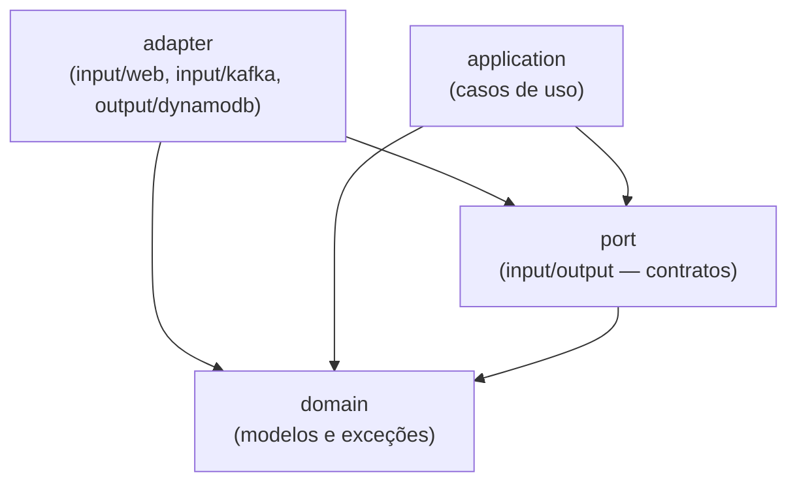
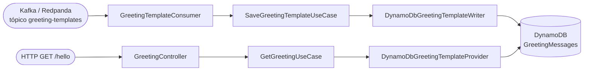

# itau-code-challange-starter-kit

[](../../actions/workflows/build.yml)
[](../../actions/workflows/test.yml)
[](../../actions/workflows/docker.yml)
[](../../actions/workflows/codeql.yml)

> ## Instruções para o candidato
>
> Este repositório é um **template utilizado em processo seletivo de vaga para Engenheiro(a) de Software**. Ele **não** é o desafio em si — é o ponto de partida.
>
> Para participar do processo:
>
> 1. Clique no botão verde **"Use this template"** no topo desta página e em **"Create a new repository"** para criar o seu próprio repositório a partir deste template (não faça um fork). Marque a opção **"Include all branches"** para trazer todas as branches disponíveis.
> 2. Escolha a branch com a stack de sua preferência — `kotlin` ou `java`. Após criar o repositório, clone-o e rode `git checkout <branch-escolhida>` (ex.: `git checkout kotlin`). Para evitar confusão, considere apagar a outra branch e definir a escolhida como padrão em Settings → Branches.
> 3. Mantenha o repositório criado **público** — o time responsável pelo processo seletivo precisa conseguir acessá-lo para avaliar a sua solução.
> 4. Implemente a solução de acordo com a **especificação enviada a você** pelo time responsável pelo processo seletivo.
> 5. Utilize a arquitetura, os padrões e a infraestrutura já configurados aqui como base — sinta-se à vontade para estendê-los conforme a especificação exigir.
> 6. Ao finalizar, siga as instruções de entrega informadas junto com a especificação recebida.
>
> O restante deste documento descreve o que já está pronto no template (stack, arquitetura, infraestrutura local e comandos disponíveis).

## Sumário

- [Stack](#stack)
- [Arquitetura](#arquitetura)
- [Estrutura de pastas](#estrutura-de-pastas)
- [Endpoints da API](#endpoints-da-api)
- [Mensageria Kafka](#mensageria-kafka)
- [Imagens Docker utilizadas](#imagens-docker-utilizadas)
- [Variáveis de ambiente](#variáveis-de-ambiente)
- [Como rodar](#como-rodar)
- [Comandos do Makefile](#comandos-do-makefile)
- [Testes](#testes)
- [Cobertura de testes](#cobertura-de-testes)

## Stack

| Categoria | Tecnologia |
|-|-|
| Linguagem | Kotlin 2.3.21 |
| Runtime | Java 21 (Eclipse Temurin) |
| Framework | Spring Boot 4.1.0 (Spring Framework 7) |
| Build | Gradle 9.5.1 (Kotlin DSL) |
| Web | Spring MVC (`spring-boot-starter-webmvc`) |
| Serialização JSON | Jackson 3 (`tools.jackson`, incluindo módulo Kotlin) |
| Banco de dados | Amazon DynamoDB (via AWS SDK for Java v2) |
| Mensageria | Kafka (protocolo) via Spring Kafka, broker real = Redpanda |
| Testes | JUnit 5, Mockito, Konsist (teste de arquitetura), MockMvc |
| Cobertura | JaCoCo (gate mínimo de 90% de instruções) |
| Containers | Docker + Docker Compose |

## Arquitetura

O projeto segue **arquitetura hexagonal**: o núcleo do negócio (domínio) não depende de nenhum framework, banco de dados ou broker de mensagens. Toda comunicação com o mundo externo passa por **portas** (interfaces) implementadas por **adaptadores**. A regra de dependência é sempre unidirecional, em direção ao domínio.



*As setas indicam "depende de" — sempre apontando em direção ao domínio.*

Essa regra é validada automaticamente por um **teste de arquitetura** (`HexagonalArchitectureTest`, usando a lib [Konsist](https://github.com/LemonAppDev/konsist)), que quebra o build caso alguma camada viole a direção de dependência esperada — por exemplo, se `domain` importar algo do Spring, ou se `application` importar um `adapter` diretamente.

### Camadas

#### 1. `domain` — núcleo do negócio
Modelos e exceções de domínio, sem nenhuma dependência externa (nem Spring).

- `domain/model/Greeting.kt` — a saudação já renderizada, pronta para resposta.
- `domain/model/GreetingTemplate.kt` — um template de saudação (`id` + `template` com placeholder `%s`).
- `domain/exception/BlankRequesterNameException.kt` — nome do solicitante em branco.
- `domain/exception/InvalidGreetingTemplateException.kt` — template inválido (id ou texto em branco).

#### 2. `port` — contratos do hexágono
Interfaces que definem a borda entre o núcleo e o mundo externo.

- **`port/input`** (portas de entrada / *driving*) — o que a aplicação **oferece**:
  - `GetGreetingUseCase` — obter uma saudação para um nome.
  - `SaveGreetingTemplateUseCase` — persistir um novo template de saudação.
- **`port/output`** (portas de saída / *driven*) — o que a aplicação **precisa**:
  - `GreetingTemplateProvider` — obter um template aleatório.
  - `GreetingTemplateRepository` — salvar um template.

#### 3. `application` — casos de uso
Implementa os *input ports*, orquestrando regras de negócio usando apenas `domain` e `port` (nunca conhece detalhes de HTTP, Kafka ou DynamoDB).

- `GreetingService` — valida o nome (não pode ser vazio/branco), pede um template aleatório e monta a saudação final.
- `SaveGreetingTemplateService` — valida `id`/`template` (não podem ser vazios/brancos) e delega a persistência ao repositório.

#### 4. `adapter` — integrações com o mundo externo
Implementações concretas das portas, organizadas por tecnologia. Cada adaptador é isolado — trocar um por outro não exige alterar `domain` nem `application`.

- **`adapter/input/web`** (*driving adapter*, HTTP):
  - `GreetingController` — expõe `GET /hello`, sempre responde em JSON.
- **`adapter/input/kafka`** (*driving adapter*, mensageria):
  - `GreetingTemplateConsumer` — `@KafkaListener` que consome o tópico `greeting-templates`, desserializa a mensagem (usando o `ObjectMapper` Jackson 3 da própria aplicação) e chama `SaveGreetingTemplateUseCase`.
- **`adapter/output/dynamodb`** (*driven adapter*, persistência):
  - `DynamoDbGreetingTemplateProvider` — implementa `GreetingTemplateProvider` (faz `Scan` na tabela e escolhe um template aleatório).
  - `DynamoDbGreetingTemplateWriter` — implementa `GreetingTemplateRepository` (faz `PutItem`).
  - `DynamoDbConfig` — configura o `DynamoDbClient` (endpoint, região, credenciais locais).

### Fluxo de dados



Ou seja: novos templates chegam via Kafka e são persistidos no DynamoDB; o endpoint HTTP lê aleatoriamente qualquer template já persistido (seja o seed inicial ou os que vieram via Kafka) e devolve a saudação renderizada.

## Estrutura de pastas

```
src/main/kotlin/br/com/itau/challenge/
├── Application.kt                          # bootstrap Spring Boot
└── hello/
    ├── domain/                             # modelos e exceções de domínio
    ├── port/{input,output}/                # contratos (interfaces)
    ├── application/                        # casos de uso
    └── adapter/
        ├── input/{web,kafka}/              # driving adapters
        └── output/dynamodb/                # driven adapters

src/test/kotlin/                            # testes unitários (sem infra externa)
src/integrationTest/kotlin/                 # testes de integração (infra real via Docker)

infra/                                       # seeds de infraestrutura local (Docker Compose)
├── dynamodb/                               # script + dados de seed do DynamoDB
└── redpanda/                               # script + dados de seed do tópico Kafka

http/                                       # arquivos .http para chamar a API manualmente
```

## Endpoints da API

### `GET /hello`

Retorna uma saudação aleatória para o nome informado. **Sempre responde em JSON**, inclusive em erros.

| Parâmetro | Obrigatório | Descrição |
|-|-|-|
| `name` | Sim | Nome do solicitante (não pode ser vazio/branco) |

**Sucesso:**
```
GET /hello?name=Ada
200 OK
{"message": "Hello, Ada!"}
```

**Erro (nome ausente ou em branco):** resposta de erro padrão do Spring Boot (JSON, já que não há views HTML configuradas).

Exemplos prontos em [`http/hello.http`](http/hello.http) (execute com a extensão REST Client do VS Code, o cliente HTTP do IntelliJ, ou via `make http`).

## Mensageria Kafka

### Tópico `greeting-templates` (entrada)

Novos templates de saudação entram pelo Kafka, não por HTTP: `GreetingTemplateConsumer` escuta o tópico `greeting-templates` e persiste cada mensagem recebida via `SaveGreetingTemplateUseCase`.

**Schema da mensagem (JSON):**
```json
{"id": "k1", "template": "Yo %s! Great to have you online!"}
```

| Campo | Obrigatório | Descrição |
|-|-|-|
| `id` | Sim | Identificador do template (não pode ser vazio/branco) |
| `template` | Sim | Texto do template, com `%s` como placeholder para o nome (não pode ser vazio/branco) |

**Como publicar uma mensagem de teste:**
- Pelo Redpanda Console (http://localhost:8081) → tópico `greeting-templates` → *Produce Message*.
- Via `rpk`: `docker compose run --rm --entrypoint rpk redpanda-seed topic produce greeting-templates --brokers redpanda:9092`.
- Via `make kafka-seed`: roda novamente o job de seed, republicando as mensagens de [`infra/redpanda/greeting-templates-seed.jsonl`](infra/redpanda/greeting-templates-seed.jsonl) no tópico.
- Exemplos prontos em [`infra/redpanda/greeting-templates-seed.jsonl`](infra/redpanda/greeting-templates-seed.jsonl) — os mesmos usados no seed inicial.

## Imagens Docker utilizadas

| Serviço | Imagem | Finalidade |
|-|-|-|
| `app` | build local (`eclipse-temurin:21-jdk` → `eclipse-temurin:21-jre`) | a própria aplicação |
| `dynamodb` | `amazon/dynamodb-local:3.3.0` | DynamoDB local (modo in-memory) |
| `dynamodb-seed` | `amazon/aws-cli:2.36.8` | cria a tabela e popula os dados iniciais |
| `dynamodb-admin` | `aaronshaf/dynamodb-admin:5.3.4` | console web para inspecionar a tabela |
| `redpanda` | `docker.redpanda.com/redpandadata/redpanda:v26.1.14` | broker Kafka-compatível (modo KRaft, single-node) |
| `redpanda-seed` | `docker.redpanda.com/redpandadata/redpanda:v26.1.14` | aplica a config do cluster (`config.sh`), depois cria o tópico e publica mensagens iniciais (`seed.sh`), usando `rpk` |
| `redpanda-console` | `docker.redpanda.com/redpandadata/console:v3.9.0` | console web para inspecionar tópicos/mensagens |

> Todas as imagens usam versões fixas (nunca `latest`) para builds reprodutíveis.

> **Por que Redpanda em vez do Apache Kafka?** É um binário único em C++ (sem JVM, sem ZooKeeper), com startup quase instantâneo — mais leve para ambiente local, mantendo 100% de compatibilidade com o protocolo Kafka (a aplicação usa `spring-kafka` normalmente, sem nenhum código específico do Redpanda).

## Variáveis de ambiente

Todas têm valor padrão para desenvolvimento local (fora do Docker Compose) e são sobrescritas dentro do `docker-compose.yml` para apontar para os hostnames internos dos containers.

| Variável | Padrão (local) | Descrição |
|-|-|-|
| `DYNAMODB_ENDPOINT` | `http://localhost:8000` | endpoint do DynamoDB |
| `DYNAMODB_REGION` | `us-east-1` | região (fake, para o SDK) |
| `GREETING_TABLE_NAME` | `GreetingMessages` | tabela do DynamoDB |
| `KAFKA_BOOTSTRAP_SERVERS` | `localhost:19092` | broker Kafka/Redpanda |
| `KAFKA_CONSUMER_GROUP_ID` | `hello-greeting-template-consumer` | group id do consumer |
| `GREETING_TEMPLATES_TOPIC` | `greeting-templates` | tópico consumido |

## Como rodar

Pré-requisito único: **Docker** (com Docker Compose). O `make` já vem instalado por padrão em Linux e macOS; no Windows, use o **WSL2** (o Makefile depende de utilitários estilo Unix e não roda direto no PowerShell/cmd).

```bash
make up      # sobe tudo em background: app + DynamoDB + Redpanda (+ seeds + consoles)
make logs    # acompanha os logs da aplicação
curl "http://localhost:8080/hello?name=Ada"
make stop    # derruba tudo
```

Consoles web disponíveis depois de subir a stack:

| Console | URL |
|-|-|
| Aplicação | http://localhost:8080 |
| DynamoDB Admin | http://localhost:8001 |
| Redpanda Console | http://localhost:8081 |

### Loop de desenvolvimento rápido (rodando pela IDE)

Para iterar mais rápido durante o desenvolvimento — com debugger, breakpoints e sem reconstruir a imagem Docker a cada mudança — rode a aplicação direto pela IDE em vez de `make up`/`make run`:

```bash
make db-up        # só DynamoDB Local + console web
make kafka-up  # só Redpanda + console web
```

Esses comandos retornam assim que os containers **sobem**, não quando os jobs de seed **terminam** — espere alguns segundos (acompanhe com `make logs` ou pelos consoles web) antes de rodar a aplicação, senão ela pode consultar a tabela/tópico antes de estarem populados.

Depois rode `Application.kt` (ou `./gradlew bootRun`) direto pela IDE. Os valores padrão em `application.yaml` (`localhost:8000` para o DynamoDB, `localhost:19092` para o Redpanda) já apontam para essas portas — nenhuma variável de ambiente extra é necessária.

### Solução de problemas

- **Primeiro `make up` demorando:** na primeira execução o Docker baixa ~5 imagens (`dynamodb-local`, `aws-cli`, `redpanda`, `redpanda-console`, `dynamodb-admin`), então pode levar alguns minutos dependendo da sua internet. Acompanhe com `make logs` — se não houver progresso nenhum por vários minutos, aí sim algo está errado.
- **Erro `port is already allocated` / `address already in use`:** a stack ocupa as portas `8080` (app), `8000`/`8001` (DynamoDB), `8081` (Redpanda Console) e `9092`/`19092` (Redpanda). Libere a porta em conflito (encerrando o processo que a está usando) ou pare qualquer outra stack local que já esteja rodando.
- **Ficou algo travado/inconsistente:** `make clean-containers` remove todos os containers do projeto (rodando ou parados, incluindo órfãos) para você começar do zero.

## Comandos do Makefile

Execute `make help` a qualquer momento para ver esta lista no terminal.

### Aplicação

| Comando | Descrição |
|-|-|
| `make build` | constrói a imagem Docker de runtime da aplicação |
| `make run` | sobe a stack em primeiro plano (logs no terminal) |
| `make up` | sobe a stack em background |
| `make logs` | acompanha os logs da aplicação (`docker compose logs -f`) |
| `make stop` | derruba os containers da stack (`docker compose down`) |
| `make http` | chama os arquivos `.http` contra a app rodando (via container Node, sem dependência local) |

### DynamoDB

| Comando | Descrição |
|-|-|
| `make db-up` | sobe o DynamoDB Local + console web e popula a tabela `GreetingMessages` |
| `make db-seed` | roda novamente o job de seed (idempotente — a tabela não é recriada, os itens são sobrescritos) |
| `make db-scan` | lista todos os itens atualmente na tabela |
| `make db-down` | para o DynamoDB Local + console web |

### Kafka / Redpanda

> **Nota:** a criação automática de tópicos (`auto_create_topics_enabled`) fica desabilitada por `infra/redpanda/config.sh` logo que o cluster sobe (roda antes de `seed.sh`, no mesmo container `redpanda-seed`). Ou seja, tópicos precisam ser criados explicitamente — via `make kafka-topic-create` ou pelo próprio seed — antes de produzir/consumir mensagens.

| Comando | Descrição |
|-|-|
| `make kafka-up` | sobe o Redpanda + console web e popula o tópico `greeting-templates` |
| `make kafka-seed` | roda novamente o job de seed (cria o tópico se não existir; mensagens são republicadas — tópicos Kafka são *append-only*, então o total de mensagens cresce a cada execução) |
| `make kafka-topic-create NAME=meu-topico [PARTITIONS=3]` | cria um novo tópico no Redpanda com o nome e o número de partições informados (`PARTITIONS` é opcional, padrão `1`) |
| `make kafka-produce-accounts-events TOPIC=meu-topico [COUNT=50]` | produz eventos de teste no formato `{"account": {...}}` (id/owner UUID aleatórios, `created_at` aleatório nos últimos 10 minutos, `status` ENABLED/DISABLED aleatório) para o tópico informado (`COUNT` é opcional, padrão `100`) |
| `make kafka-produce-transactions-events TOPIC=meu-topico [COUNT=50]` | produz eventos de teste no formato `{"transaction": {...}, "account": {...}}` (id's UUID aleatórios, `type` CREDIT/DEBIT, `amount` aleatório de 0.01 a 10000, `status` APPROVED/DECLINED, `timestamp` aleatório nos últimos 10 minutos; `account.created_at` aleatório nos últimos 10 anos, `account.status` sempre ENABLED, `balance.amount` aleatório de 0.00 a 20000) para o tópico informado (`COUNT` é opcional, padrão `100`) |
| `make kafka-consume TOPIC=meu-topico` | imprime todas as mensagens atualmente no tópico informado (usa timeout de 5s, já que `rpk topic consume` não tem um modo "ler o que existe e sair") |
| `make kafka-down` | para o Redpanda + console web |

### Testes

| Comando | Descrição |
|-|-|
| `make test` | constrói a imagem de teste e roda `./gradlew check` (testes unitários + gate de cobertura ≥ 90%) dentro de um container — não precisa de nenhuma infra externa |
| `make integration-test` | sobe DynamoDB + Redpanda reais e roda `./gradlew integrationTest` contra eles |

### Limpeza

| Comando | Descrição |
|-|-|
| `make clean-containers` | remove **todos** os containers do projeto (rodando ou parados), incluindo órfãos de serviços renomeados/removidos |
| `make clean` | remove as imagens Docker construídas localmente |

## Testes

O projeto tem duas suítes de teste bem separadas:

### `src/test` — testes unitários (`./gradlew test`)
Não dependem de nenhuma infraestrutura externa — rodam em qualquer lugar, inclusive dentro do container Docker de teste (`make test`), sem Docker-in-Docker.

- Testes de domínio, aplicação e adapters usando **fakes/mocks** para os *ports* (nenhuma chamada real a DynamoDB ou Kafka).
- `GreetingControllerTest` usa `MockMvc` + `@MockitoBean` para isolar a camada web.
- `HexagonalArchitectureTest` valida a direção de dependências entre as camadas (Konsist).

### `src/integrationTest` — testes de integração (`./gradlew integrationTest`)
Rodam contra infraestrutura **real**, subida via Docker Compose. Ficam propositalmente fora do `check`/`test` para não exigir infra no pipeline padrão.

- `DynamoDbGreetingTemplateIntegrationTest` — grava e lê de uma tabela DynamoDB real (`make db-up`).
- `GreetingTemplateConsumerIntegrationTest` — sobe o contexto Spring real (incluindo o `@KafkaListener` de produção) conectado ao broker Redpanda real (`make kafka-up`); publica uma mensagem no tópico e valida que o *listener* da aplicação a consome sozinho.

Rode com `make integration-test` (sobe a infra necessária automaticamente antes de executar).

## Cobertura de testes

Configurado com **JaCoCo**, gate mínimo de **90% de cobertura de instruções**, que falha o build (`./gradlew check`) se não for atingido. Um resumo legível é impresso diretamente no output do Gradle (sem precisar abrir o relatório HTML), com contagem por tipo de métrica (instruções, branches, linhas, complexidade, métodos, classes) e o veredito do gate.

Relatório HTML completo em `build/reports/jacoco/test/html/index.html` após rodar `./gradlew test` ou `make test`.
